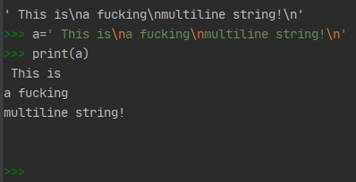

# Collections

Subjects of interest are:
* str (immutable sequences of Unicode codepoints)
* bytes
* list
* dict

## Strings 
 
 String literals 
 ```python
"this is a string"
# Could be either single or double quotes, Python will work the same with both options.
# But still, you should be consistent when using quotes and stick with one of the options.
'this is also a string'
```

But what if we need strings with Newlines?
Well, we got two options
1. Multiline strings (noted by triple quotes)
2. Using escape sequences ( inserting \n into quoted text)

Although it might look like one string in example below, actually it will be printed properly with `print` function.



Also, Python uses universal newline `'\n'`
Backslash could be used for escaping specific characters

### Raw strings

When using raw strings, we can avoid inserting many backslash characters, so it's just WYSIWYG.
```python
path = r'C:\Users\Sergei_Malkov\PycharmProjects\pycharm_debug\documentation\pictures'
```

Python doesn't have separate character type, "characters" are simply `one element strings`.
`str()` function could be used to transform floats or integers to strings
Strings are collections and specific elements could be addressed by their indexes. 
```python
a = "parrot"
for i in a:
    print(i)
``` 
Example of specific element addressing:
```python
# Execute each line as separate statement in python console after using previous code snippet
a[4]
type(a[4])
```

And now it's time to mention methods that could be applied to strings.
Python has a `class`, called str, details could be found at `help(str)`.
Then, `class` has some `methods` which for now look like functions.
I can apply a method to function like this:<br>`a.upper()` to convert to lowercase.

## Bytes

Bytes are immutable sequences of bytes
They are used for raw byte data
b'data'
b"data"

There is a `bytes` constructor but we will get to it later, looks like this is more advanced topic.
Conversion between bytes and strings is being performed by decode/encode functions. Encode string to get bytes, decode bytes to get string, simple as that.

One should remember that files, network resoureces and http responses are being transmitted as bytes sequences. That's why I must know the difference between bytes and strings so early.

## List
List is mutable sequence of objects
```python
b=[2,4,6]
c=[3,'foobar',9.3]
d=['alpha','beta',[1,-2,'gabba'],'delta',c]
```
Lists may consist of strings, integers and floats in any combination.
Even more, lists could include other lists as their elements.

Very popular idiom with python is when variable is being set to empty list, which is being adjusted as program being executed.
Methods could be applied to list, allowing some operations on their elements.

```python
b=[]
b.append(1)
b.append(2)
b.append(3)
```

Also, we have `list` constructor which allows to transform string literal to list, like this:
list("characters")

## Dictionary
mutable mapping of keys to values

`{ k1: v1, k2: v2 }`
Items could be retrieved by key <br>

e = {} \# empty dictionary idiom <br>
**Dictionaries are unordered items, opposed to lists!**
Lists and dictionaries are essentual when it comes to iterating over for-loops.
